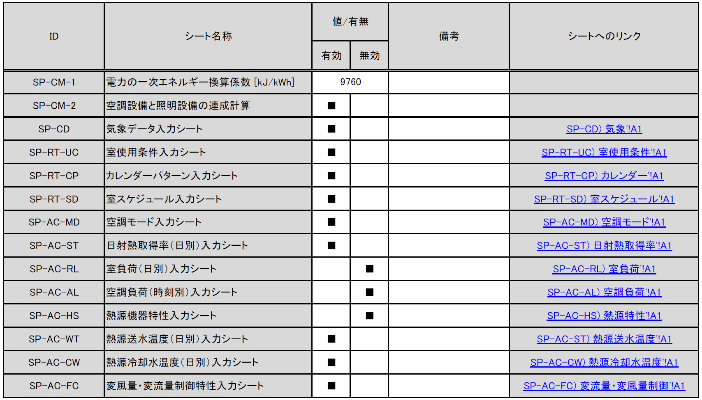
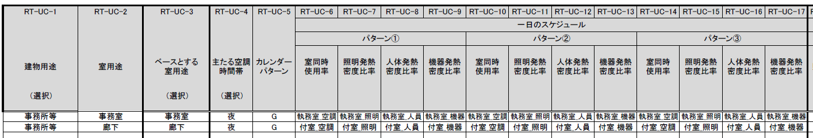
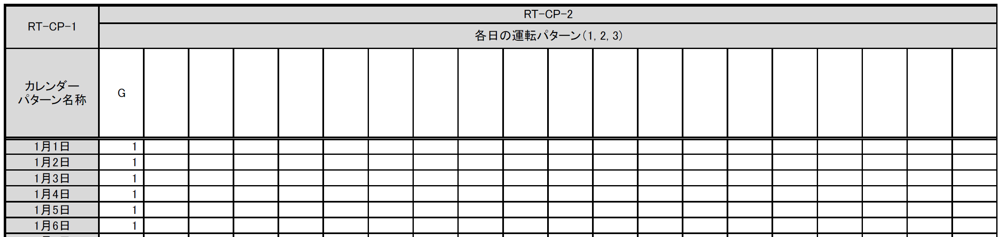
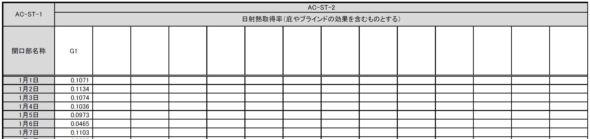
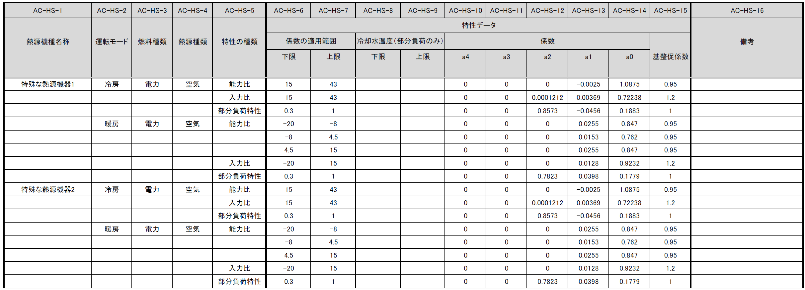

Builelibでは、入力シート（Microsoct Excel形式）に室の形状、外皮・設備の仕様等を入力し、これをアップロードすることで計算を実行します。

- 入力シートは、建築物省エネ基準に基づくエネルギー消費性能計算プログラム（WEBPRO） の入力シート（xlsmファイル、xlsxファイル）と同一のものが利用可能です。
- WEBPROの入力シートにBuilelib専用の特殊シート（SPシート）を追加することにより、計算条件を詳細に指定して計算を実行することができます。

### 入力シート（Excelファイル）

- [WEBPROの入力ファイル](https://github.com/MasatoMiyata/builelib/blob/master/sample/Builelib_inputSheet.xlsx)
- [Builelib専用のSPシート](https://github.com/MasatoMiyata/builelib/blob/master/sample/Builelib_inputSheet_SPシート.xlsx)

### サンプル

| 名称            | 説明                       | ダウンロードリンク |
|-----------------|----------------------------|--------------------|
| サンプル01      | WEBPROのサンプル           | [Builelib_inputSheet_sample_001.xlsx](https://github.com/MasatoMiyata/builelib/blob/master/sample/Builelib_inputSheet_sample_001.xlsx) |
| サンプル02      | Builelib専用のSPシートの例 | [Builelib_inputSheet_sample_002.xlsx](https://github.com/MasatoMiyata/builelib/blob/master/sample/Builelib_inputSheet_sample_002.xlsx) |

### 入力シートの作成方法

!!! Note
    - 基本的な作成方法については、 [非住宅建築物に関する省エネルギー基準に準拠したプログラム](https://building.lowenergy.jp/) にて公開されている「エネルギー消費性能計算プログラム（非住宅版）の入力マニュアル（PDF）」をご覧下さい。
    - Builelib専用のSPシートを使用して計算を実行するためには、SPシートを「移動またはコピー」して、WEBPRO入力シートのファイル（Excelファイル）内にシートを生成する必要があります。

---

#### SP-CM 計算モード入力シート

このシートでは、一次エネルギー換算係数の指定、連成計算の有無、各SPシートの有効/無効の切り替えを行うことができます。

<strong style="color: black;">表. SP-CM 計算モード入力シート</strong>

    

- [SP-CM-1] 電力の一次エネルギー換算係数
    - 電力の一次エネルギー換算係数[kJ/kWh]を入力します。設計一次エネルギー消費量の計算に反映されます（基準一次エネルギー消費量には反映されません）。入力がない場合はデフォルト値（9760 kJ/kWh）で計算されます。

- [SP-CM-2] 空調設備と照明設備の連成計算
    - 「有効」の欄に「■」を入力すると、連成計算が有効になります。連成計算が有効である場合、空調設備のエネルギー消費量の計算時に想定される照明器具による内部発熱量参照値には、「様式4:照明入力シート」に入力された照明器具の消費電力が使用されます。「無効」とした場合は、標準室使用条件で定められた内部発熱量参照値が使用されます。

- [SP-CD] 気象データ入力シート ～ [SP-AC-FC] 変風量・変流量制御特性入力シート
    - 「有効」の欄に「■」を入力すると、各入力シートに入力された情報が計算に反映されます。「無効」とした場合は、当該入力シートの内容は計算に反映されません。

---

#### SP-CD 気象データ入力シート

- 任意の気象データ（外気温湿度、日射量）を入力してエネルギー消費量の計算を行うことができます。
- 例えば、[https://climate.onebuilding.org/](https://climate.onebuilding.org/) などより、世界各国の気象データを入手して任意の地点における計算を行うことができます。

<strong style="color: black;">表. SP-CD 気象データ入力シート</strong>

    

- [CD-2] 外気温度
    - 外気温度を入力します。単位は ℃ です。
- [CD-3] 外気湿度
    - 外気湿度（絶対湿度）を入力します。単位は kgDA/kg です。
- [CD-4] 法線面直達日射量
    - 法線面直達日射量を入力します。単位は W/m2 です。
- [CD-5] 水平面天空日射量
    - 水平面天空日射量を入力します。単位は W/m2 です。
- [CD-6] 水平面夜間放射量
    - 水平面夜間放射量を入力します。単位は W/m2 です。

---

#### SP-RT-UC 室使用条件入力シート

- 任意の室使用条件を入力し、新たな室用途を作成することができます。既存の室用途の一部条件のみを書き換えることもできます。
  

<strong style="color: black;">表. SP-RT-UC 室使用条件入力シート（前半）</strong>

    

<strong style="color: black;">表. SP-RT-UC 室使用条件入力シート（後半）</strong>

    

- [RT-UC-1] 建物用途
    - 建物用途名称を入力します。WEBPROの選択肢と同じです（任意の名称を入力することはできません）。
- [RT-UC-2] 室用途
    - 室用途名称を入力します。WEBPROの選択肢と同じ名称か、任意の名称を入力します。 
- [RT-UC-3] ベースとする室用途
    - WEBPROの選択肢よりベースとする室用途名称を入力します。[RT-UC-4]以降の入力項目について入力が無かった場合は、ここで入力された室用途の標準室使用条件の値が使用されます。  
- [RT-UC-4] 主たる空調時間帯
    - 「昼」「夜」「終日」より選択します。これにより、負荷計算に使用する日平均外気温湿度の値が変わります。
- [RT-UC-5] カレンダーパターン
    - WEBPROの選択肢（A～F）か、後述する様式SP-RT-CP カレンダーパターン入力シートにて作成したカレンダーパターンの名称を入力します。
- [RT-UC-6]～[RT-UC-9] 一日のスケジュール（パターン①）室同時使用率、照明発熱密度比率、人体発熱密度比率、機器発熱密度比率
    - 「パターン①」の室同時使用率、照明発熱密度比率、人体発熱密度比率、機器発熱密度比率のスケジュール（一日の変化）を入力します。ここで入力する名称は、後述する様式SP-RT-SD	室スケジュール入力シートで設定します。
- [RT-UC-10]～[RT-UC-13] 一日のスケジュール（パターン①）室同時使用率、照明発熱密度比率、人体発熱密度比率、機器発熱密度比率
    - 「パターン②」の室同時使用率、照明発熱密度比率、人体発熱密度比率、機器発熱密度比率のスケジュール（一日の変化）を入力します。ここで入力する名称は、後述する様式SP-RT-SD	室スケジュール入力シートで設定します。
- [RT-UC-14]～[RT-UC-17] 一日のスケジュール（パターン①）室同時使用率、照明発熱密度比率、人体発熱密度比率、機器発熱密度比率
    - 「パターン③」の室同時使用率、照明発熱密度比率、人体発熱密度比率、機器発熱密度比率のスケジュール（一日の変化）を入力します。ここで入力する名称は、後述する様式SP-RT-SD	室スケジュール入力シートで設定します。
- [RT-UC-18]～[RT-UC-20] 空調 発熱量等 参照値（照明発熱、人体発熱、機器発熱）
    - 空調負荷計算時に想定する内部発熱量の参照値（各スケジュールにおける100%の値）を入力します。
- [RT-UC-18]～[RT-UC-20] 空調 発熱量等 参照値（照明発熱、人体発熱、機器発熱）
    - 空調負荷計算時に想定する内部発熱量の参照値（各スケジュールにおける100%の値）を入力します。
- [RT-UC-21] 空調 作業強度指数
    - 空調負荷計算時に想定する作業強度指数（1～5）を入力します。これにより人体発熱量が変わります。
    - 1の場合は92W/人、2の場合は106W/人、3の場合は119W/人、4の場合は131W/人、5の場合は145W/人となります。
- [RT-UC-22] 空調 外気導入量
    - 空調負荷計算時に想定する外気導入量[(m3/h)/m2]を入力します。
- [RT-UC-23] 換気 年間換気時間（非空調室）
    - 換気設備のエネルギー消費量を計算する際に想定する年間換気時間を入力します。非空調室のみが対象です。
- [RT-UC-24] 照明 年間照明点灯時間 
    - 照明設備のエネルギー消費量を計算する際に想定する年間照明点灯時間を入力します。
- [RT-UC-25]～[RT-UC-28] 給湯 用途別の日積算湯使用量（洗面、シャワー、厨房、その他） 
    - 給湯設備のエネルギー消費量を計算する際に想定する日積算湯使用量を入力します。単位が [L/m2日] であることに注意が必要です（標準室使用条件においては、一部の室用途で日積算湯使用量の単位は [L/人日] となっています）。

---

#### SP-RT-CP カレンダーパターン入力シート

- 任意のカレンダーパターンを入力して、エネルギー消費量の計算に反映させることができます。
- 作成したカレンダーパターンは、様式SP-RT-UC 室使用条件入力シート に入力します。
  

<strong style="color: black;">表. SP-RT-CP カレンダーパターン入力シート</strong>

    

- [RT-CP-1] カレンダーパターン名称
    - 任意の名称を入力します。
- [RT-CP-2] 各日の運転パターン
    - 各日について、様式SP-RT-UC 室使用条件入力シート で入力された「パターン①」「パターン②」「パターン③」のどのパターンで運転するかを指定します。パターン①の場合は「1」、パターン②の場合は「2」、パターン③の場合は「3」を入力します。

---

#### SP-RT-SD 室スケジュール入力シート

- 任意の室スケジュール（一日の時刻別の比率）のパターンを入力して、エネルギー消費量の計算に反映させることができます。
- 作成したパターンは、様式SP-RT-SD 室スケジュール入力シート に入力します。
  

<strong style="color: black;">表. SP-RT-SD 室スケジュール入力シート</strong>

    

- [RT-SD-1] パターン名称
    - 任意の名称を入力します。
- [RT-SD-2] 各時刻の比率
    - 0時（0:00～0:59）～23時（23:00～23:59）について、時刻別の比率を入力します。比率が1である場合は参照値と同じ値になります。1を超える値も入力できます。

---

#### SP-AC-MD 空調モード入力シート

- 空調設備の運転条件を入力することができます。
  

<strong style="color: black;">表. SP-AC-MD 空調モード入力シート</strong>

    

- [AC-MD-2] 運転モード
    - 各日の空調の運転モード（冷房、暖房）を入力します。
- [AC-MD-3] 室温設定値
    - 各日の室温設定値を入力します。
- [AC-MD-4] 湿度設定値
    - 各日の湿度設定値を入力します。

---

#### SP-AC-ST 日射熱取得率（日別）入力シート

- 開口部の日射熱取得率を入力することができます。
  

<strong style="color: black;">表. SP-AC-ST 日射熱取得率（日別）入力シート</strong>

    

- [AC-ST-1] 開口部名称
    - 開口部名称を入力します。ここで入力した開口部名称と同じ名称の開口部が様式2-3で入力されていなければなりません。これは日射熱取得率以外の諸元を定めるためです。
- [AC-ST-2] 日射熱取得率
    - 各日の日射熱取得率の値（庇やブラインド等の効果を見込んだ値）を入力します。

---

#### SP-AC-RL 室負荷（日別）入力シート

- 空気調和設備における各室の日積算室負荷（外気負荷は含まない）を任意に入力することができます。
  

<strong style="color: black;">表. SP-AC-RL 室負荷（日別）入力シート</strong>

    

- [AC-RL-1] 階、空調ゾーン名称、室負荷の種類
    - 様式2-1で定義した階、空調ゾーン名称と、室負荷の種類（冷房、暖房）を入力します。
- [AC-RL-2] 日積算室負荷
    - 各日の日積算室負荷の値を入力します。冷房負荷は正の値、暖房負荷は負の値とします。
    - 同一の日に冷房負荷と暖房負荷の両方が発生する場合もあります。これは、例えば、午前は暖房要求、午後は冷房要求となることがあり得るからです。

---

#### SP-AC-AL 空調負荷（時刻別）入力シート

- 空気調和設備における各空調機群の空調負荷（室負荷＋外気負荷）を任意に入力することができます。 この空調負荷には、外気処理に関わる省エネ技術（全熱交換器、外気カット、外気冷房）が全て考慮された負荷を入力することとします。このシートを使用した場合、プログラム内部ではこれらの省エネ技術の効果は見込まれません。
  

<strong style="color: black;">表. SP-AC-AL 空調負荷（時刻別）入力シート</strong>

    

- [AC-AL-1] 空調機群名称
    - 空調機群の名称を入力します。ここで入力した空調機群名称と同じ名称の空調機群が様式2-7で入力されていなければなりません。
- [AC-AL-2] 空調負荷
    - 時々刻々の空調負荷を入力します。単位は[kW]です。暖房負荷は負の値、冷房負荷は正の値とします。空調が停止しているときは0を入力します。

---

#### SP-AC-HS 熱源機器特性入力シート

- 空気調和設備における熱源群の熱源機器特性を任意に入力することができます。

<strong style="color: black;">表. SP-AC-HS 熱源機器特性入力シート</strong>

    

- [AC-HS-1] 熱源機種名称
    - 熱源機種の名称を入力します。名称は自由に付けることができます。
    - ここで入力した名称を「様式2-5:熱源入力シート ⑥熱源機種」に入力すると、本シートで指定した特性でエネルギー消費計算をすることができます。同じ名称を重複して使用することはできません。
    - 既にWEBPROで指定されている熱源機種名称と同じ名称を使用することはできません。
    - 同一の機種について、後述する「運転モード」及び「特性の種類」を複数指定する場合は、図の例のように「熱源機種名称」は空欄として下の行に連続して入力します。

- [AC-HS-2] 運転モード
    - 入力する特性が、冷房（冷房運転モードの特性）か暖房（暖房運転モード時の特性）かを選択します。
    - 熱源機種名称と同様に、同じ運転モードの特性を複数指定する場合は、「運転モード」は空欄として下の行に連続して入力します。

- [AC-HS-3] 燃料種類
    - 入力する熱源機器の燃料種類を選択します。選択肢は下表のとおりです。
    - この選択により、熱源機器のエネルギー消費量を一次エネルギー換算する際に使用する係数（一次エネルギー換算係数）の値が決まります。
    - 同一の「熱源機種名称」と「運転モード」の組み合わせについて1つしか「燃料種類」は指定できません。

| 選択肢         | 定義／適用                                               | 備考 |
|----------------|----------------------------------------------------------|------|
| 電力           | 電力により駆動する熱源である場合                         |      |
| ガス           | 都市ガスにより駆動する熱源である場合                     |      |
| 重油           | 重油により駆動する熱源である場合                         |      |
| 灯油           | 灯油により駆動する熱源である場合                         |      |
| 液化石油ガス   | 液化石油ガス（LPG）により駆動する熱源である場合          |      |
| 蒸気           | 熱源外部から供給蒸気された蒸気により駆動する熱源である場合 |      |
| 温水           | 熱源外部から供給蒸気された温水により駆動する熱源である場合 |      |
| 冷水           | 熱源外部から供給蒸気された冷水により駆動する熱源である場合 |      |

- [AC-HS-4] 熱源種類
    - 入力する熱源機器の熱源（ヒートソース）の種類を選択します。選択肢は下表のとおりです。この選択により、能力比及び入力比が何の関数となるかが決まります。
    - 同一の「熱源機種名称」と「運転モード」の組み合わせについて1つしか「熱源種類」は指定できません。

| 選択肢 | 定義／適用 | 備考 |
|--------|------------|------|
| 空気   | 空冷式の熱源機器である場合 | 能力比及び入力比は外気乾球温度（冷房）、外気湿球温度（暖房）の関数となる。 |
| 水     | 水冷式の熱源機器である場合 | 能力比及び入力比は熱源水温度（冷却水温度）の関数となる。 |
| 不要   | 燃焼式の熱源機器等、外部の熱源を必要としない場合 | 能力比及び入力比は外気乾球温度の関数となる。 |

- [AC-HS-5] 特性の種類
    - 入力する特性の種類を選択します。選択肢は下表に示すとおりです。
    - 同一の「熱源機種名称」と「運転モード」の組み合わせについて、複数の特性を指定する場合は、 図の例のように「熱源機種名称」から「熱源種類」までを空欄として下の行に連続して入力します。

| 選択肢         | 定義／適用                                                                 | 備考                                                         |
|----------------|--------------------------------------------------------------------------|--------------------------------------------------------------|
| 能力比         | 最大能力がどのように変化するかを入力する場合                              | 能力比は「④熱源種類」の選択肢により何の関数となるかが変わります。 |
| 入力比         | 最大入力がどのように変化するかを入力する場合                              | 入力比は「④熱源種類」の選択肢により何の関数となるかが変わります。 |
| 部分負荷特性   | 負荷率により入力がどのように変化するかを入力する場合                      | 部分負荷特性は負荷率の関数となります。                           |
| 送水温度特性   | 送水温度により入力がどのように変化するかを入力する場合                    | 送水温度特性は送水温度の関数となります。                         |

- [AC-HS-6]～[AC-HS-7] 係数の適用範囲 下限・上限
    - 入力する特性データの適用範囲を指定します。
    - 何の範囲を指定するかは「特性の種類」が何の関数であるか、つまり「熱源種類」の選択肢により変わります。
    - 例えば、「運転モード」が「冷房」、「④熱源種類」が「水」、「特性の種類」が「能力比」である場合は、熱源水温度の範囲を入力します。

- [AC-HS-8]～[AC-HS-9] 冷却水温度（部分負荷のみ） 下限・上限
    - 「熱源種類」が「水」であり、「特性の種類」が「部分負荷特性」である場合において、冷却水温度により特性を変えたい場合は、本欄に各特性の適用範囲を入力します。入力をしない場合は空欄とします。
    - 複数の範囲に対する特性データを入力する場合、「特性データ 係数の適用範囲 下限」及び「特性データ 係数の適用範囲 上限」を空欄とすることはできません。これらのセルにも値の入力が必要です。

- [AC-HS-10]～[AC-HS-14] 特性データ 係数
    - 熱源の特性は4次式の関数として指定することができます。ここでは特性を表す関数の係数を入力します。
    - a4は4次の項の係数、a3は3次の項の係数、a2は2次の項の係数、a1は1次の項の係数、a0は切片です。

- [AC-HS-15] 特性データ基整促係数
    - WEBPROでは、試験所等で測定された性能と実際に建物に据え付けられたときの性能との差を埋めるための係数（基整促係数）が考慮されています。ここでは、当該係数の値を入力します。
    - 基整促係数を 1 とすれば補正がかからない条件での計算ができます。

---

#### SP-AC-WT 熱源送水温度（日別）入力シート

- 熱源群ごとに送水温度を入力することができます。
  

<strong style="color: black;">表. SP-AC-WT 熱源送水温度（日別）入力シート</strong>

    

- [AC-WT-1] 熱源群名称
    - 熱源群の名称を入力します。ここで入力した熱源群名称と同じ名称の熱源群が様式2-5で入力されていなければなりません。
- [AC-WT-2] 熱源水温度
    - 日別の送水温度を入力します。

---

#### SP-AC-CW 熱源冷却水温度（日別）入力シート

- 熱源群ごとに冷却水温度を入力することができます。
  

<strong style="color: black;">表. SP-AC-CW 熱源冷却水温度（日別）入力シート</strong>

    

- [AC-CW-1] 熱源群名称
    - 熱源群の名称を入力します。ここで入力した熱源群名称と同じ名称の熱源群が様式2-5で入力されていなければなりません。
- [AC-CW-2] 熱源水温度
    - 日別の冷却水温度を入力します。

---

#### SP-AC-FC 変風量・変流量制御特性入力シート

- 空気調和設備における二次ポンプ群の変流量制御、空調機群の変風量制御を選択した場合のエネルギー消費特性を任意に入力することができます。
  

<strong style="color: black;">表. SP-AC-FC 変風量・変流量制御特性入力シート</strong>

    

- [AC-FC-1] 制御方式名称
    - 制御方式の名称を入力します。名称は自由に付けることができます。 ここで入力した名称を「様式2-6:二次ポンプ入力シート ⑧流量制御方式」もしくは「様式2-7:空調機入力シート ⑪風量制御方式」に入力すると、本シートで指定した特性でエネルギー消費計算をすることができます。
- [AC-FC-2] 係数 x4
    - 負荷率の4次関数の係数のうち、4次の項の係数を入力します。
- [AC-FC-3] 係数 x3
    - 負荷率の4次関数の係数のうち、3次の項の係数を入力します。
- [AC-FC-4] 係数 x2
    - 負荷率の4次関数の係数のうち、2次の項の係数を入力します。
- [AC-FC-5] 係数 x1
    - 負荷率の4次関数の係数のうち、1次の項の係数を入力します。
- [AC-FC-6] 係数 a
    - 負荷率の4次関数の係数のうち、切片の値を入力します。

---
